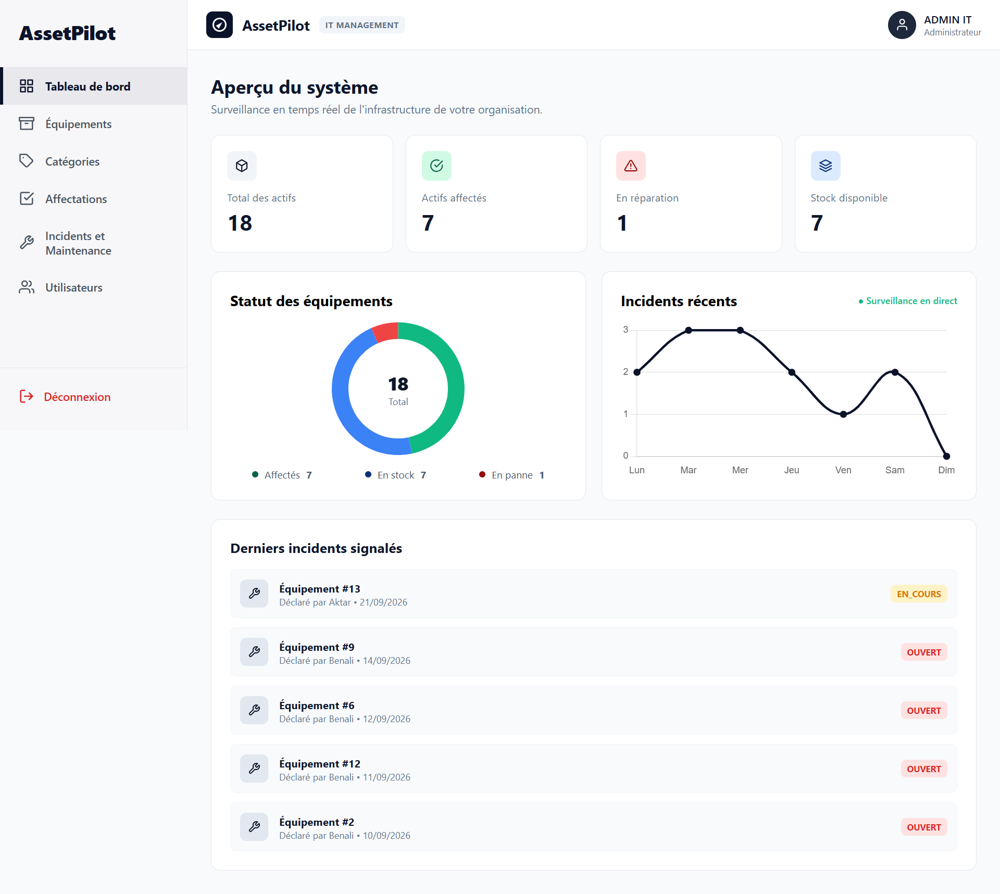
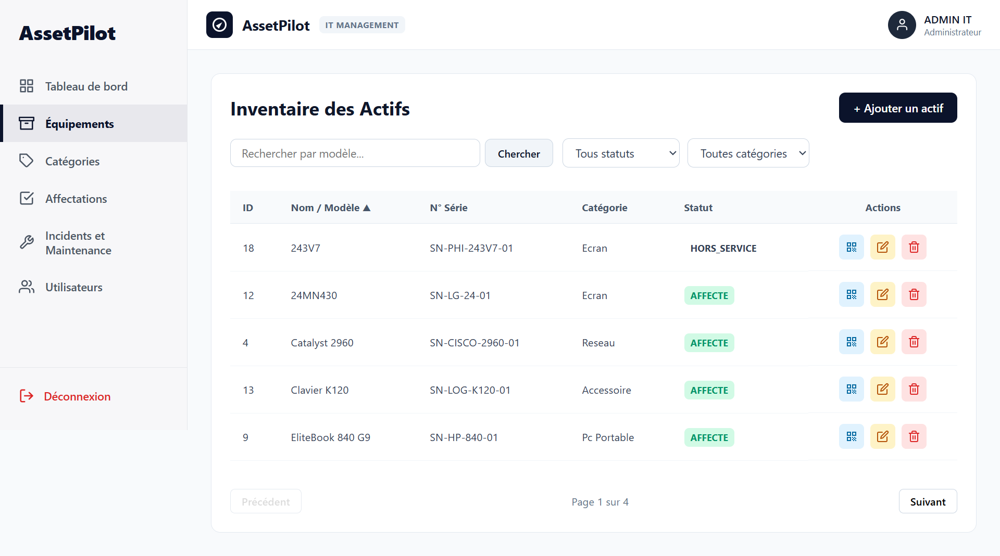
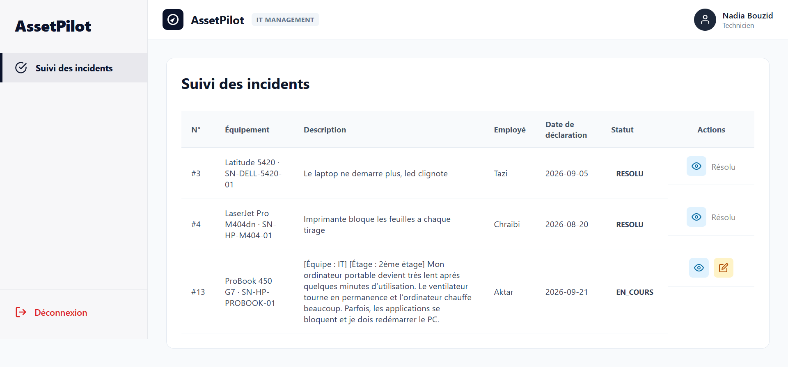

# 1. Nom du projet

**Nom du projet :** AssetPilot -- Système de Gestion du Parc Informatique (Frontend)

------------------------------------------------------------------------

# 2. Présentation du projet

AssetPilot est une application de gestion du parc informatique composée d'une interface utilisateur moderne développée avec React.js. Elle permet de gérer le catalogue du matériel (équipements, catégories), les utilisateurs (employés et techniciens), les affectations du matériel ainsi que les incidents techniques, le tout avec une navigation sécurisée basée sur les rôles. L'application s'adresse aux entreprises souhaitant centraliser la gestion de leur matériel informatique. Son objectif principal est de simplifier le suivi du matériel, les affectations et la maintenance grâce à une interface réactive, ergonomique et sécurisée connectée à l'API REST AssetPilot.

------------------------------------------------------------------------

# 3. Problématique

Le problème identifié est que la gestion manuelle du parc informatique (matériel, affectations, tickets de maintenance) est souvent lente, dispersée et source d'erreurs.

La solution proposée offre une application web moderne qui centralise ces informations dans une interface unique et sécurisée, avec des vues et des actions adaptées à chaque rôle (Administrateur, Employé, Technicien).

------------------------------------------------------------------------

# 4. Fonctionnalités principales

- Se connecter avec authentification JWT (token stocké localement)
- Consulter un tableau de bord avec des statistiques et des graphiques (Chart.js)
- Gérer le catalogue du matériel : équipements et catégories (CRUD)
- Générer des QR codes pour les équipements
- Gérer les utilisateurs (employés et techniciens) avec CRUD
- Effectuer les affectations du matériel et les restitutions
- Déclarer des incidents techniques et les assigner aux techniciens
- Suivre l'état des réparations par les techniciens
- Consulter son profil et son équipement personnel
- Protection des routes selon le rôle (ADMIN, EMPLOYE, TECHNICIEN)
- Gestion des erreurs HTTP (401, 403, etc.) et redirection automatique
- Formulaires validés avec React Hook Form et Yup

------------------------------------------------------------------------

# 5. Technologies utilisées

Technologie                   Utilisation dans le projet
  ----------------------------- ----------------------------
React 19                      Développement de l'interface
Vite 7                        Bundler et serveur de développement
React Router DOM 7            Routage et navigation
Axios                         Appels HTTP vers l'API REST
React Hook Form               Gestion des formulaires
Yup                           Validation des formulaires
JWT Decode                    Lecture du rôle depuis le token
Chart.js / React ChartJS 2    Graphiques et statistiques
ReactQRCode                   Génération et affichage des QR codes
React Icons                   Icônes de l'interface
Vitest & Testing Library      Tests unitaires
CSS pur                       Styles et design system
Git/GitHub                    Versionnement

------------------------------------------------------------------------

# 6. Installation et lancement

## 6.1 Prérequis

- Node.js 20 ou supérieur
- npm
- Git
- Backend AssetPilot démarré sur le port 8080

## 6.2 Cloner le dépôt

``` bash
git clone https://github.com/votre-compte/assetpilot-frontend.git
```

## 6.3 Ouvrir le dossier

``` bash
cd assetpilot-frontend
```

## 6.4 Installer les dépendances

``` bash
npm install
```

## 6.5 Variables d'environnement

Le proxy de développement (Vite) redirige les appels `/api` vers le backend :

``` env
VITE_API_BASE_URL=http://localhost:8080/api
```

(facultatif : utilisé en complément de la configuration du proxy dans `vite.config.js`)

## 6.6 Lancer le projet

``` bash
npm run dev
```

L'application démarre sur le port 5173 et se connecte à l'API backend sur le port 8080.

## 6.7 Ouvrir le projet

Frontend : http://localhost:5173

**Compte administrateur initial :**
-  Email : `admin@assetpilot.com`

## 6.8 Lancer les tests

``` bash
npm test
```

## 6.9 Construire le projet pour la production

``` bash
npm run build
```

------------------------------------------------------------------------

# 7. Captures d'écran

## Capture 1

## Capture 2

## Capture 3

------------------------------------------------------------------------

# 8. Contribution personnelle

Projet réalisé individuellement.

J'ai conçu l'architecture complète du frontend.

J'ai développé l'interface React, le routage avec protection des routes selon les rôles, la gestion du token JWT, les formulaires validés avec React Hook Form et Yup, le tableau de bord avec les graphiques Chart.js ainsi que la génération des QR codes.

------------------------------------------------------------------------

# 9. Difficultés rencontrées

## Difficulté 1

J'ai rencontré des difficultés lors de la mise en place de la protection des routes selon les rôles.

Après plusieurs tests, j'ai mis en place ProtectedRoute et RoleGuard en décodant le rôle depuis le token JWT, ce qui m'a permis de mieux comprendre la gestion de l'authentification côté client.

## Difficulté 2

La gestion des erreurs HTTP (token expiré, accès refusé) nécessitait une gestion centralisée des réponses Axios.

J'ai configuré des intercepteurs dans le client Axios pour rediriger automatiquement vers la page de connexion en cas de 401 et vers la page d'accès refusé en cas de 403.

## Difficulté 3

L'authentification avec le token JWT stocké dans localStorage et la synchronisation avec le backend exigeait une configuration précise du serveur de développement.

J'ai configuré le proxy Vite pour rediriger les appels `/api` vers l'API backend sur le port 8080, ce qui m'a permis de mieux maîtriser la communication frontend-backend.

------------------------------------------------------------------------

# 10. Améliorations possibles

- Ajouter les notifications par e-mail côté interface
- Ajouter l'export Excel et le PDF côté frontend
- Ajouter le mode sombre et la personnalisation du thème
- Migrer vers TypeScript pour un typage plus strict
- Déployer le frontend avec Docker et intégrer le CI/CD

Ces améliorations permettraient d'améliorer l'expérience utilisateur, les performances et la maintenabilité de l'application.

------------------------------------------------------------------------

# ✅ Checklist finale

-   [x] Présentation du projet
-   [x] Fonctionnalités
-   [x] Technologies
-   [x] Installation
-   [x] Captures d'écran
-   [x] Contribution
-   [x] Difficultés
-   [x] Améliorations